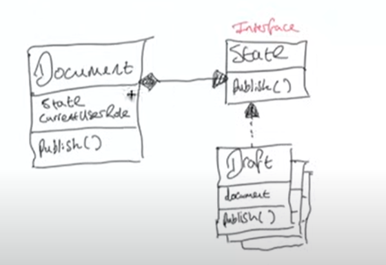

# STATE PATTERN 

the state pattern allows an object to behave differently depending on the state that it is in

say you are writing a blog post using the popular content management system, wordpress. the document or post, can be in one of the 3 states : 
1) draft
2) moderation (under review by the admin)
3) published 

there are 3 types of user roles : 
1) reader 
2) editor
3) admin 

only admins can publish documents 

## Solution with State Pattern 

the state pattern suggests that we should create state classes for each possible state of the `Document` object, and extract all state-specific logic into these classes.

The `Document` class will store a reference to one of the state classes to represent the current state that it is in. Then, instead of `Document` implementing state specific behavior by itself, it delegates all the state related work to the state object that it has a reference to : 

we should create 3 new classes for those states.

above, `Document` keeps reference to (is composed of) a `State` object. Notice that we are using polymorphism, as the `State` field can be any one of the concrete state classes (`Draft`, `Moderation`, `Published`), as we are coding to an interface, not concrete classes.

In `Document`, the `publish()` method calls `state.publish()` - it delegates the work to the concrete state object. why is this good? because our solution now satisfies the OCP : if we want to add a new state, we create a new concrete state class that implements the `State` interface - we extend our codebase (Add new class) without having to modify any current classes (`Document` in out case)

## State pattern representation in GoF

