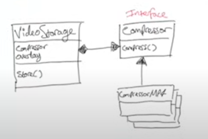
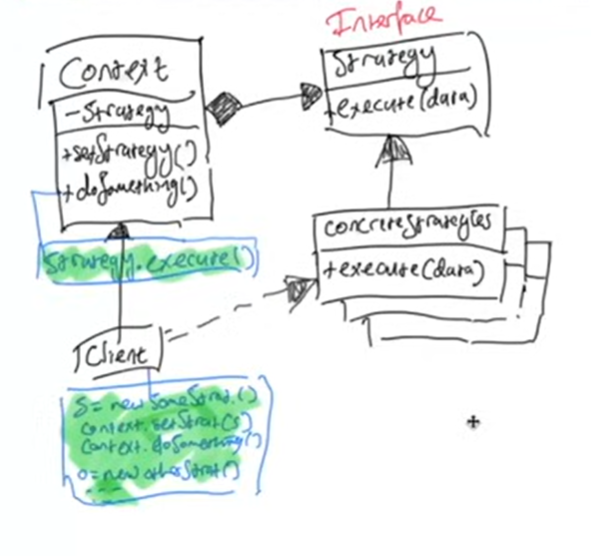

## problems with the old solution 
1) it violates the OCP, if we add more compressors or overlays, then we have to modify the existing `VideoStorage` class.

## solving using the strategy pattern 

the UML below shows that when we create a `VideoStorage` object, we pass it the concrete compressor and overlay objects that we want it to use. This is polymorphism. it can accept different types of forms 

`VideoStorage` is composed of `Compressors` and `Overlays` objects. 
(arrow with a diamond)

## GoF 

