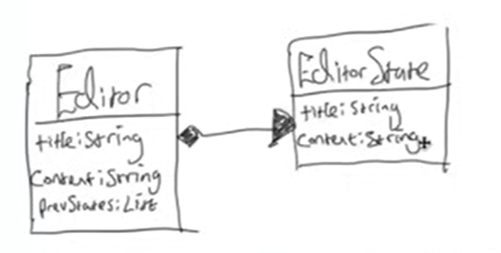
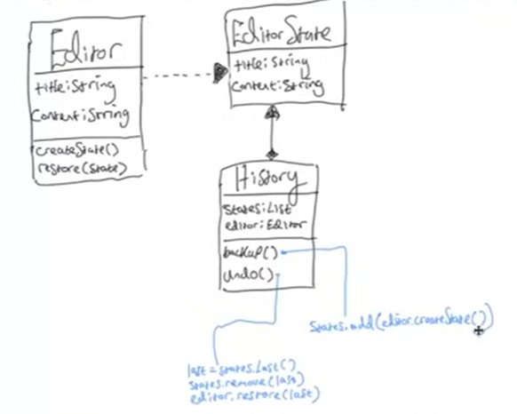
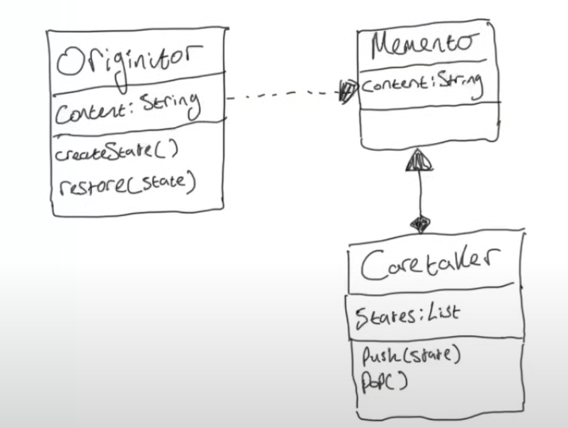

## MEMENTO PATTERN

the memento pattern is used to restore an object to a previous state.

used to save and restore the state of an object without exposing its internal details.

a common use use case is an undo/redo feature.

some things you might want to do in a text editor: 
1. add a title to the document : "test"
2. write some text "hello there"
3. chane the title of the document : "my document"

a simple way to implemet this text editor in code would be to create a single `Editor` class and have a field for `title` and `content`, and also have a field that stores each of the previous values for each field in some list 

problem with the above solution : 
-> everytime we add a new field : `author`, `date` etc. we will have to store the previous states for each of the new field.

-> and how is the undo feature applied?
if the user changed the title then changed the content, then pressed undo, the current implementation has no knowledge of what the user last did - did they change the title or the content?

instead of having multiple fields in the `Editor` class, we create a separate class to store the state of our editor at a given time.

There is a composition relationship between `Editor` and `EditorState` class, that is Editor is composed of, or has a field of the EditorState class

this solution allows you to do multiple undo and you dont end up polluting the `Editor` class with too many fields

however the above solution violates the SRP, since `Editor` class manages multiple responsibilites : 
1) state management 
2) providing the features that we need from an editor

we should take out the state management stuff and put it somewhere else

so we create a separate class called `History`

the `createState()` method returns an `EditorState` object, hence the dotted line arrow (dependency relationship). `History` has a field with a list of `EditorStates` hence the diamond arrow (composition relationship)

that is more or less how the memento pattern is like 

## Representation of the Memento pattern in the Gang of Four book (GoF)

these abstract names for the classes in the memento pattern come from the original GoF book. the solution provided earlier is slightly different from the OG pattern. Heres how - our 
`Caretaker` class is analogous with `History` class, also has a field that stores a reference to the `Editor`, so that the `History` class can restore the editors state when the user clicks on undo.

### Originator 
1) the object whose state you want to save or restore 
2) creates and stors a memento containing its current state
3) uses the memento to restore its state.

### Memento 
1) stores the state of the originator
2) is treated like a black box, meaning other classes should not modify its contents
3) provides a way to access the stored state, often through encapsulation

### Caretaker 
1) manages the mementos lifecycle, such as saving and restoring it
2) keeps track of multiple mementos if an undo/redo feature is implemented
3) does not access or modify the memento directly.

### how it works : 
1) the originator generates a memento that captures its current state
2) the caretaker stores this memento to be retrieved later
3) if needed, the originator can use the memento to retore its previous state.

### When should you use the memento pattern?

the memento pattern can be used when you want to produce snapshots of an objects state to be able to restore the object to a previous state.

## pros and cons
1) you can simplify the orignators code by letting the caretaker maintain the history of the originators state, satisfying the SRP
2) can consume alot of RAM if alot of mementos are created.