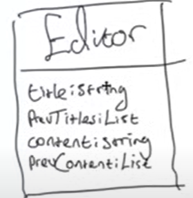

## MOMENTO PATTERN

the momento pattern is used to restore an object to a previous state.

a common use use case is an undo feature

some thinsg you might want to do in a text editor: 
1. add a title to the document : "test"
2. write some text "hello there"
3. chane the title of the document : "my document"

a simple way to implemet this text editor in code would be to create a single `editor` class and have a field for `title` and `content`, and also have a field that stores each of the previous values for each field in some list 

